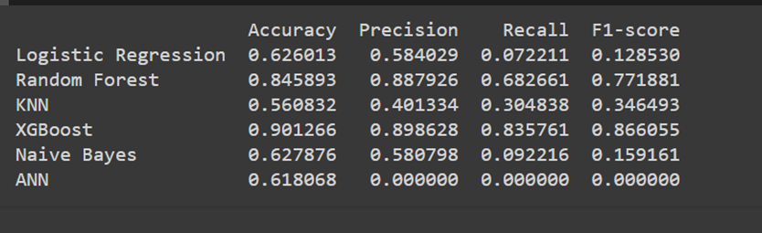

# Project Name: Medical Fraud Detection (Classification)

## Overview
This project aims to detect instances of medical fraud using machine learning classification techniques. The dataset consists of multiple datasets with beneficiary data, inpatient data, outpatient data, and the target feature indicating fraud. The datasets were imported from Google Drive, cleaned, and preprocessed before training various models.

## Steps Taken:
1. **Data Import**: 
    - Datasets were imported from Google Drive.
    - (Give the path of your own datasets either Google Drive,upload on colab or local storage).
2. **Data Cleaning**: 
    - Missing values were removed.
    - Data types of features were fixed.
    - Unnecessary features were removed.
3. **Feature Engineering**:
    - New features were added.
    - various date features were analysed and new features replacing dates with period were introduced.
4. **EDA (Exploratory Data Analysis)**:
    - Basic data exploration was performed
5. **Data Merging**:
    - Inpatient and outpatient training and testing data were merged.
    - A new dataset called All_patients was created for train and test_allpatients.
    - Beneficiary data was merged with the merged patient all data.
    - The final pre encoded datasets were generated as Train_Allpatientdata and Test_allpatients.
6. **Encoding and Scaling**:
    - Label encoding was applied to the columns having non numerical datatype. 
    - Standard scaling was performed on selected features to scale the features on a proper scale for better training.
    - This encoded and scaled data were saved in Train.csv and Test.csv.
7. **Model Training**:
    - Data was split into training and validation sets (80:20 ratio).
    - Shuffling was done before training to randomize the order.
    - Various classification models like Random Forest, KNN,Naive bayes, Logistic Regression, XGBoost,ANN were trained and validated.
8. **Model Evaluation**:
    - Metrics such as accuracy, recall, precision, F1-score, and confusion matrix were calculated.
9. **Model Comparison**:
    #### Metrics Analysis:

- **Logistic Regression**: Achieves an accuracy of 62.6%, with low recall and precision.
- **Random Forest**: Shows improved performance with an accuracy of 84.6% and balanced precision and recall.
- **KNN (K-Nearest Neighbors)**: Performs relatively poorly compared to other models, with an accuracy of 56.1% and low precision and recall.
- **XGBoost**: Demonstrates the best performance with an accuracy of 90.1%, high precision, recall, and F1-score.
- **Naive Bayes**: Similar to Logistic Regression, achieving an accuracy of 62.8% with low precision and recall.
- **ANN (Artificial Neural Network)**: Fails to perform effectively, yielding an accuracy of 61.8% with zero precision, recall, and F1-score.
10. **Testing**:
- XGBoost model was tested on the test data, and predicted values were generated.

#### For detailed performance analysis, refer the performance analysis pdf.

## Conclusion
Overall, the XGBoost model achieved an accuracy of 90.13% on the test data, indicating its effectiveness in detecting medical fraud. 

## How to Use
1. Clone the repository.
2. Run the provided Jupyter Notebook or Python script to reproduce the analysis.
3. Ensure the required libraries are installed.
4. Provide the necessary input data for predictions.

## File Structure
- `data/`: Contains all the datasets.
- `notebooks/`: Contains Jupyter Notebooks for data preprocessing, analysis, and modeling.
- `results/`: Contains result files, including predicted values.

## Requirements
- Python 3.x
- Required libraries listed in `requirements.txt`

## Contributors
- [Pratik Thakur](https://github.com/pratikthakur2)